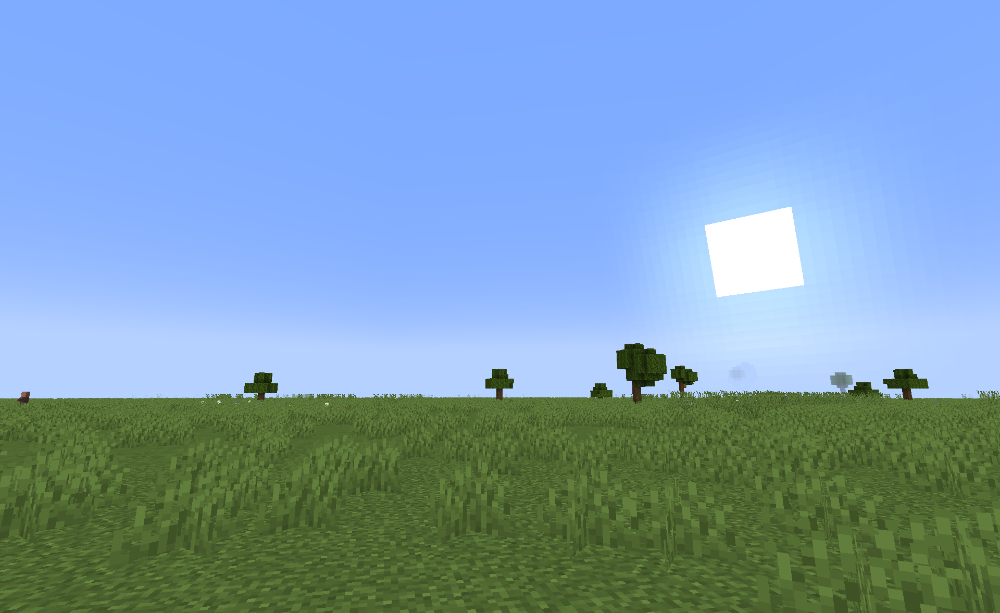
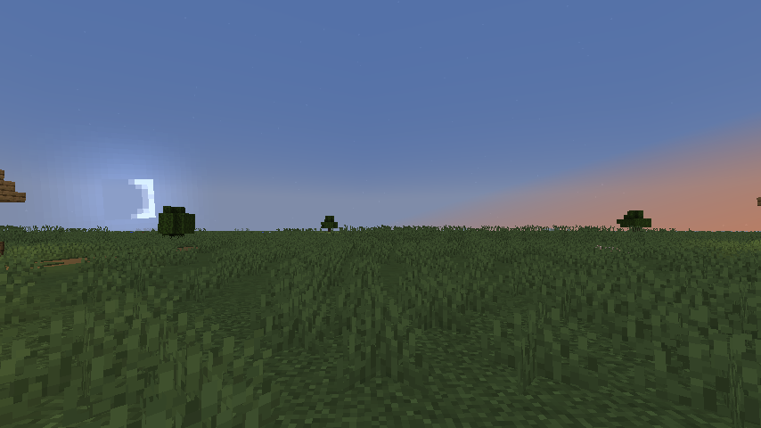

# Accurate Skies

This simple mod turns the overworld's sky into a more one.

> [!IMPORTANT]
> This mod will turn Minecraft's default day-night cycle into a 24 hours cycle

> [!WARNING]
> This mod won't work with most shaders, or even any.
> Some will be more compatible than other (like [Bliss Shaders](https://modrinth.com/shader/bliss-shader))

There are 2 modes:
- System time
- Geo localisation

### System time

This mode relies on your system's clock and your timezone. It's **enabled by default**.

### Geo localisation

On the other hand, this second mode uses geo localisation to calculate the sun's position in the sky:
- Your position is found using your ip (using [ipify](https://api.ipify.org)).
- Geo localisation is done **on your device** (a db gets installed).

The main advantage of enabling it is to let you have a more accurate sun position
and enable the `Accurate Celestial Bodies` setting.

You can enable geo localisation via 2 ways:
- The `/adnc enable_geolocalisation` command
- In this mod's configs:

## Accurate Celestial Bodies

> [!NOTE]
> This setting requires the `Use Geo Localisation` setting to be enabled.

> [!WARNING]
> Once enabled, every player on a server will get receive the server's geolocalisation data and timezone.
> But this is not possible to see unless using a modified version of this mod.

Once enabled, you will be able to see the sun and the moon like they would in real life !
(And yes, the moon can now appear in the day)

## What platforms this mod supports

This mod can be used everywhere. Both on the client and server, or any of those. But:
- Modded server, vanilla client: The `Accurate Celestial Bodies` setting won't work 
but a day will **still take 24 hours**.
- Vanilla server, modded client: A Minecraft day will now take 12 minutes, like it does normally
but if you wish, you can still enable the `Accurate Celestial Bodies` setting. So the `Use Geo Localisation` setting
won't work **on its own**.

## Credits

A huge thanks to [Richard Körber](https://github.com/shred) and their [suncalc](https://github.com/shred/commons-suncalc) library for making this possible !

## TODO:

- [ ] Add packet to know if a client has the mod.
  If no, send the English text instead of Text objects in command outputs